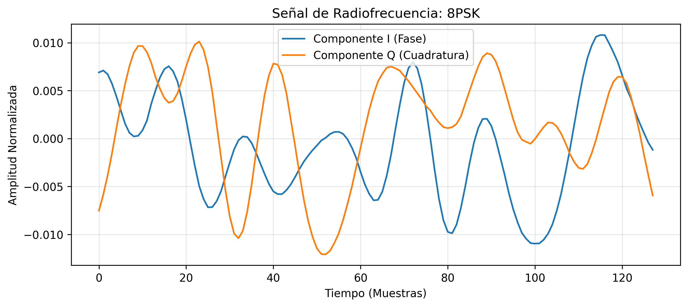
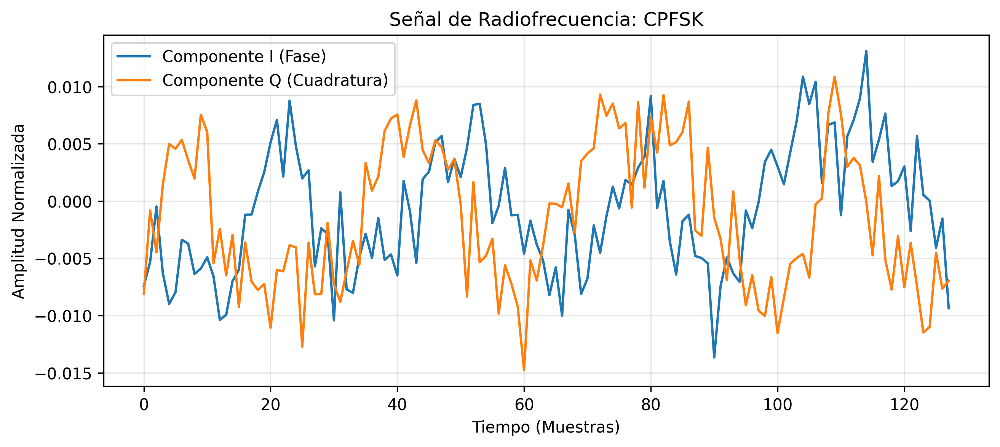
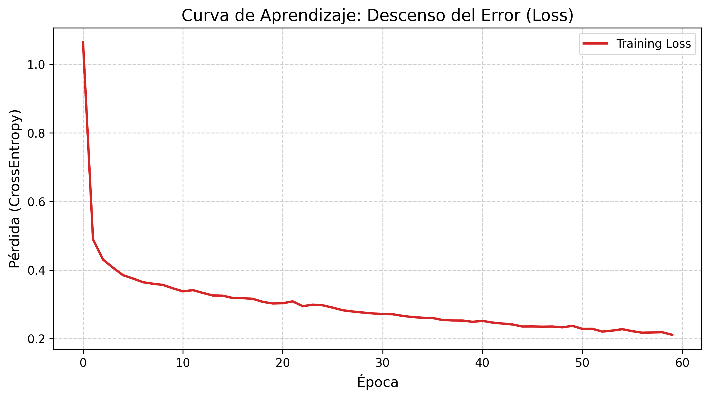
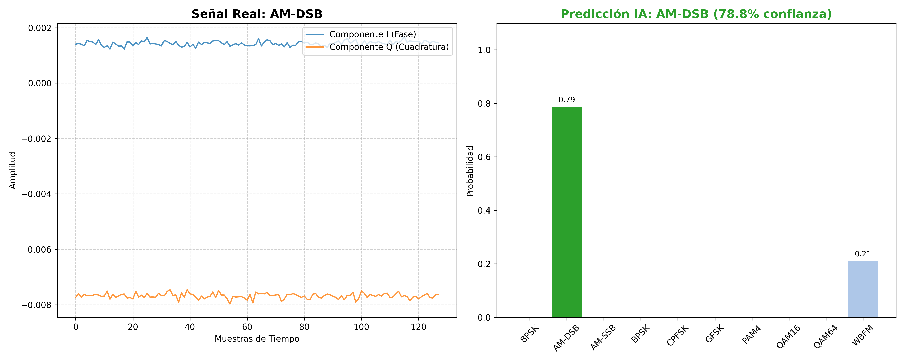
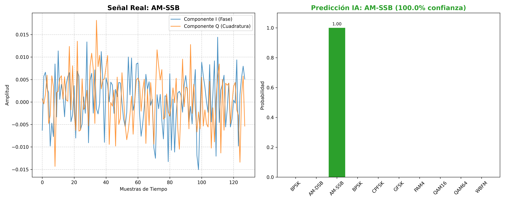
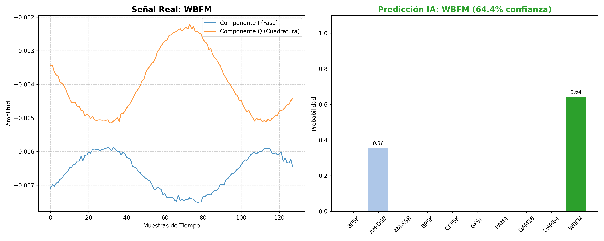
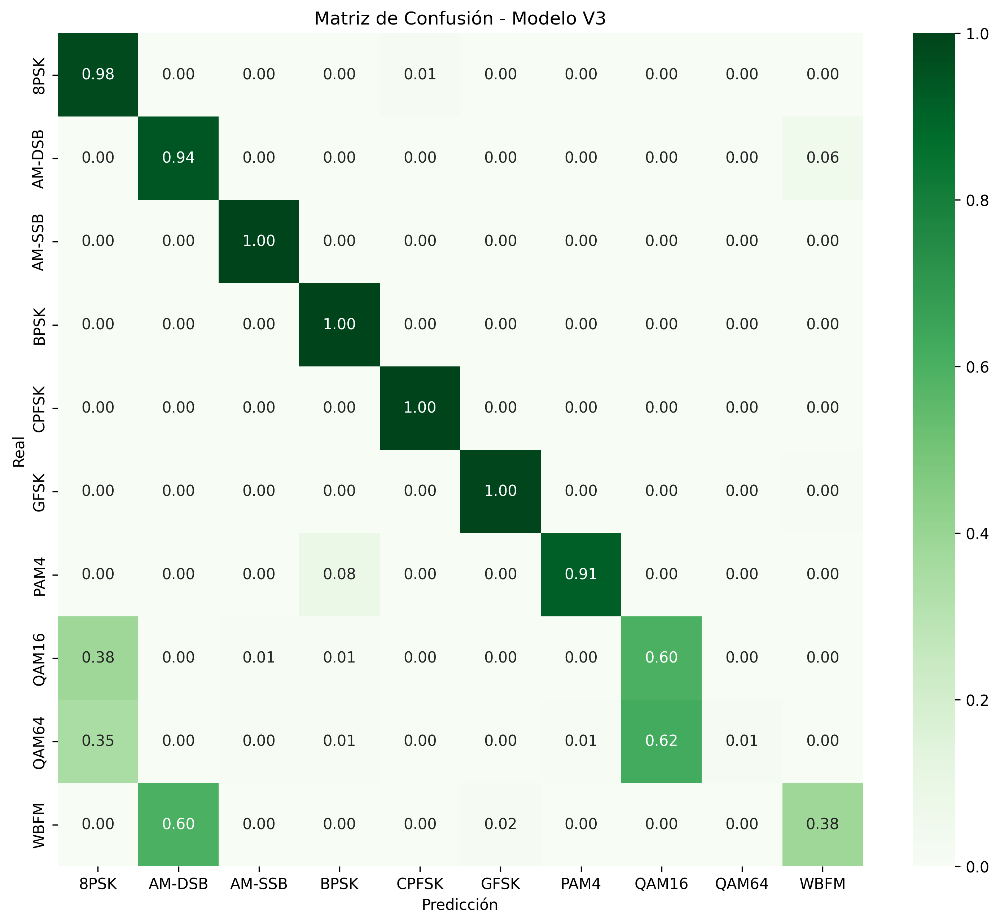

# Clasificador de Modulaciones de Radio con Deep Learning

Este proyecto utiliza una red neuronal convolucional (CNN) en PyTorch para clasificar 10 tipos de modulaciones de radio del dataset RML2016.10a.

## 🏋️‍♂️🤖 Entrenamiento













## 📊 Resultados



## 🚀 Cómo usar
1. Clona el repo.

```bash
        git clone [https://github.com/IvanBohorquez21/radio-signal-classifier](https://github.com/IvanBohorquez21/radio-signal-classifier)
        cd radio-signal-classifier
```

2. Instala dependencias: `pip install -r requirements.txt`.
3. Coloca el dataset en `data/raw/`.
4. Ejecuta `notebooks/dataset.ipynb` para procesar los datos.
5. Entrena con `notebooks/train.ipynb`.